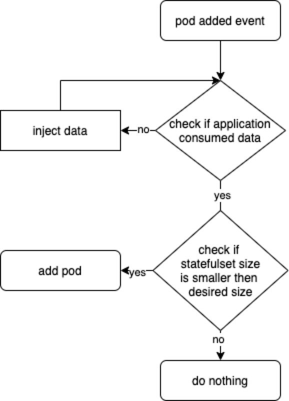
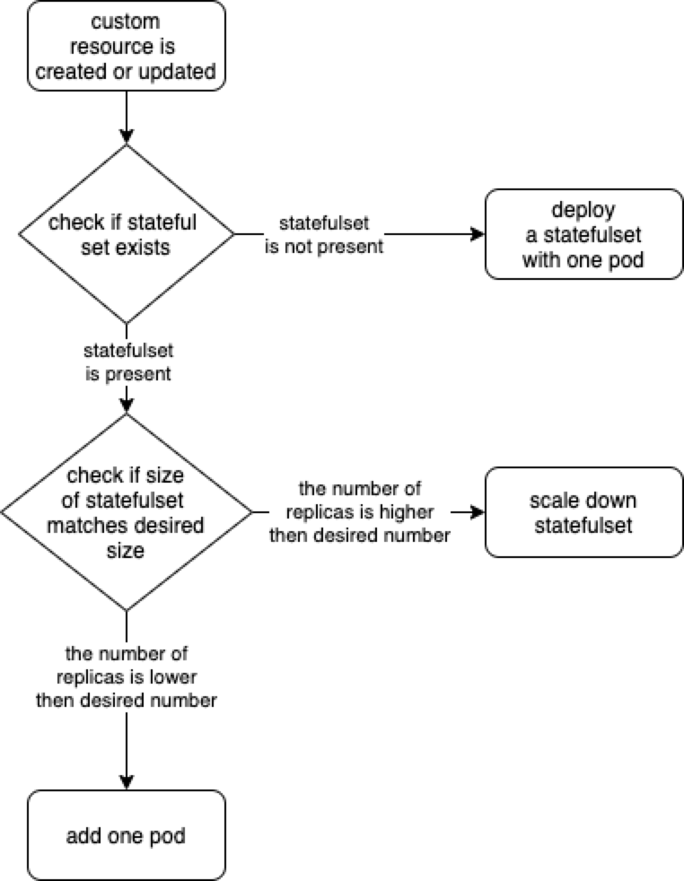
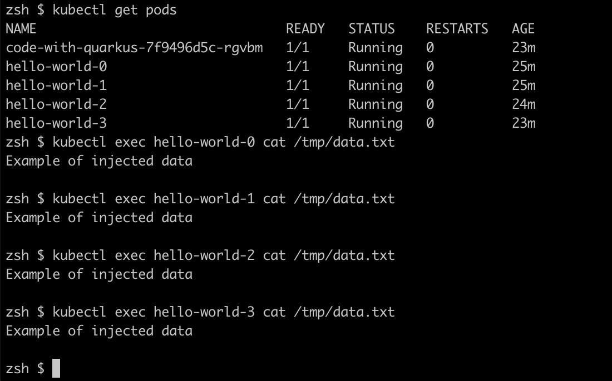

= Kubernetes Operator with Java and Quarkus

===== TL;DR

Even though Kubernetes provides extensive support for multiple container management operations, it doesn't cover all potential cases related to application management. Some applications need the manual intervention of a human operator. An kubernetes operator is an application that runs in the cluster and manages resources.
It allows transferring of operational knowledge of the human operator into software components. Operators can be used for multiple purposes such as restoring data, creating cloud resources, resilience testing, and many others.

==== Why java?

* Being able to develop operators in Java can bring a lot of benefits for companies and individuals that are focused mainly on the Java stack.
* Quarkus with the main focus on cloud-native, and microservice solutions looks like a good fit for building an operator.
* Operator SDK also has neat features such as generating Kubernetes resources for operator deployment and creating custom resource definition yaml files based on the Java code.
* Java kubernetes-client supports multiple operations: such as creating resources, patching, copying files,  executing commands, fetching logs and
 https://github.com/fabric8io/kubernetes-client/tree/master/kubernetes-examples/src/main/java/io/fabric8/kubernetes/examples[many others].

==== Hello world operator

An Operator can be used for various reasons and one of the most common tasks of an operator is to manage database clusters, preparing database schemas, restoring backups, etc. This simple hello world operator demonstrates how to create a stateful set  via kubernetes API and make sure that the data is loaded into each pod and consumed by the application before creating new pods.

It performs following operations with Kubernetes API using java  https://github.com/kubernetes-client/java[kubernetes-client] and https://github.com/quarkiverse/quarkus-operator-sdk[quarkus-operator-sdk] :

* watch custom resource creation/modification
* watch pod creation/modification
* create and scale statefulsets
* check content of log output
* execute commands in a container

==== Generate a project

An official webpage to Generate Quarkus application https://code.quarkus.io. The generated project also includes https://docs.docker.com/engine/reference/builder/[Dockerfile] for building https://docs.docker.com/engine/reference/commandline/images/[Docker images].

.Dockerfile
[%collapsible]
====
[,Dockerfile]
----
FROM registry.access.redhat.com/ubi8/ubi-minimal:8.3
WORKDIR /work/
RUN chown 1001 /work \
    && chmod "g+rwX" /work \
    && chown 1001:root /work
COPY --chown=1001:root target/*-runner /work/application

EXPOSE 8080
USER 1001

CMD ["./application", "-Dquarkus.http.host=0.0.0.0"]
----
====

===== Add dependencies into a project:

https://github.com/quarkiverse/quarkus-operator-sdk[quarkus-operator-sdk]
[,xml]
----
<dependency>
<groupId>io.quarkiverse.operatorsdk</groupId>
<artifactId>quarkus-operator-sdk</artifactId>
<version>1.8.2</version>
</dependency>
----
https://github.com/kubernetes-client/java[kubernetes-client]
[,xml]
----
<dependency>
 <groupId>io.kubernetes</groupId>
 <artifactId>client-java</artifactId>
 <version>12.0.0</version>
</dependency>
----

Proxy kubernetes cluster API to local machine for the local development

----
kubectl --namespace kube-system --disable-filter=true proxy kube-apiserver-kind-control-plane
----
Configure application.properties for the local development environment

----
quarkus.kubernetes-client.trust-certs=false
quarkus.kubernetes-client.namespace=default
quarkus.kubernetes-client.master-url=http://127.0.0.1:8001/
----

===== Create a custom resource definition

It is possible to extend the Kubernetes API with custom resources, in order to store and modify the desired object specification and state.

Based on the content of classes below application generates https://kubernetes.io/docs/tasks/extend-kubernetes/custom-resources/custom-resource-definitions/[custom-resource-definitions] which can be used to create https://kubernetes.io/docs/concepts/extend-kubernetes/api-extension/custom-resources/[custom-resources]. During the start application outputs yaml of custom resource definitions to a file in the directory _./target/kubernetes/_.

Create custom resource definition

.HelloWorld.java
[,java]
----
@Group("example.com")
@Version("v1alpha1")
@ShortNames("hw")
public class HelloWorld extends CustomResource<HelloWorldSpec, HelloWorldStatus> implements Namespaced {

   private HelloWorldSpec spec;
   private HelloWorldStatus status;

   // {...}
}
----

Creating specification fields of the custom resource.

.HelloWorldSpec.java
[,java]
----
public class HelloWorldSpec {

   private String name;
   private String image;
   private String data;
   private int replicas;

   // {...}
}
----

The status fields of the custom resource

.HelloWorldStatus.java
[,java]
----
public class HelloWorldStatus {

   private Integer readyReplicas = 0;

   // {...}
}
----

Create custom resource of kind HelloWorld

[,yaml]
.hello-world-example.yaml
----
apiVersion: example.com/v1alpha1
kind: HelloWorld
metadata:
  name: hello-world-example
spec:
  name: hello-world
  image: busybox
  replicas: 3
  data: |
   Example of injected data
----

----
kubectl create -f hello-world-example.yaml
----

A client for kubernetes API

.KubernetesClientProducer.java
[,java]
----
@Singleton
public class KubernetesClientProducer {

   @Produces
   public KubernetesClient kubernetesClient() {
       return new DefaultKubernetesClient(command in container);
   }
}
----

A controller which listens to custom resource creation and updates
[,java]
----
@Controller(namespaces = "default")
public class HelloWorldController  implements ResourceController<HelloWorld> {

   / ... /

   @Override
   public DeleteControl deleteResource(HelloWorld resource, Context<HelloWorld> context) {...}

   @Override
   public UpdateControl<HelloWorld> createOrUpdateResource(HelloWorld helloWorldRequest, Context<HelloWorld> context) {...}

   @Override
   public void init(EventSourceManager eventSourceManager) {...}
}
----

When the custom resource HelloWorld is created or updated operator receives an event and based on this event it creates a stateful set according to custom object content.

.HelloWorldController.java
[%collapsible]
====
[,java]
----
@Override
public UpdateControl<HelloWorld> createOrUpdateResource(HelloWorld helloWorldRequest, Context<HelloWorld> context) {
   final var spec = helloWorldRequest.getSpec();

   StatefulSet statefulset = kubernetesClient.apps().statefulSets().withName(spec.getName()).get();

   if(statefulset == null) {
       log.info("Create statefulset " + spec.getName());

       statefulset = new StatefulSetBuilder()
               .withNewMetadata()
               .withName(spec.getName())
               .endMetadata()
               .withNewSpec()
               .withReplicas(1)
               .withNewTemplate()
               .withNewMetadata()
               .addToLabels("app", spec.getName())
               .endMetadata()
               .withNewSpec()
               .addNewContainer()
               .withName(spec.getName())
               .withImage(spec.getImage())
               .withCommand("sh", "-c", "while sleep 5; do cat /tmp/data.txt; done")
               .addNewPort()
               .withContainerPort(80)
               .endPort()
               .endContainer()
               .endSpec()
               .endTemplate()
               .withNewSelector()
               .addToMatchLabels("app", spec.getName())
               .endSelector()
               .endSpec()
               .build();

       kubernetesClient.apps().statefulSets().inNamespace(namespace).create(statefulset);

       return UpdateControl.noUpdate();

   } else if (statefulset.getStatus().getReplicas() < spec.getReplicas()) {

       log.info("Scale statefulset up: " + spec.getName());

       kubernetesClient.apps()
               .statefulSets()
               .inNamespace(namespace).withName(spec.getName()).scale(statefulset.getStatus().getReplicas() + 1, true);

       return UpdateControl.noUpdate();

   } else if (statefulset.getStatus().getReplicas() > spec.getReplicas()) {

       log.info("Scale statefulset down: " + spec.getName());

       kubernetesClient.apps()
               .statefulSets()
               .inNamespace(namespace).withName(spec.getName()).scale(spec.getReplicas(), true);

       return UpdateControl.noUpdate();
   }

   return UpdateControl.noUpdate();
----
====

Containers are running following command to check if the data is present in the container, and outputs an error to a log if data is not present.

----
"while sleep 5; do cat /tmp/data.txt; done"
----

PodWatcher watches pod creatiion and modification

[,java]
----
public class PodWatcher {

private final KubernetesClient kubernetesClient;

void onStartup(@Observes StartupEvent startupEvent) throws IOException {

   public PodWatcher(KubernetesClient kubernetesClient) {
      this.kubernetesClient = kubernetesClient;
   }

   kubernetesClient.pods().watch(new Watcher<Pod>() {

   @Override
   public void eventReceived(Action action, Pod pod) {...}

   @Override
   public void onClose(WatcherException e) {...}
});

}
----

Start an operator

.QuarkusApplication.java
[,java]
----
@QuarkusMain
public class Main implements QuarkusApplication {

   @Inject
   Operator operator;

   public static void main(String... args) {
       Quarkus.run(Main.class, args);
   }

   @Override
   public int run(String... args) throws Exception {
       operator.start();
       Quarkus.waitForExit();
       return 0;
   }
}
----

When pod is created, operator fetches logs and
checks if the data from custom object is present in the pod, in case if it is not present operator outputs data to a file in the pod.

[,java]
.PodWatcher.java
----
log.info("Get pod logs " + pod.getMetadata().getName());

String logs = kubernetesClient.pods()
        .inNamespace(namespace)
        .withName(podName)
        .getLog();

log.info("Check if data is available in pod " + pod.getMetadata().getName());

if (!logs.contains("Example of injected data")) {
    log.info("Inject data into pod " + podName);
    newExecWatch(kubernetesClient, namespace, podName, spec.getData());
}
----

----
echo "Example of injected data" > /tmp/data.txt
----

After executing a command, the operator checks the log of the current pod  again. If the application has consumed the data, it adds one pod to the replica set cluster and repeats this operation until all desired pods are present and contain the data.

.PodWatcher.java
[,java]
----
kubernetesClient.apps().statefulSets().inNamespace(namespace).withName(name).scale(replicaSize + 1, true);
----

Full code of PodWatcher

.PodWatcher.java
[%collapsible]
====
[,java]
----
public class PodWatcher {

    @ConfigProperty(name = "quarkus.kubernetes-client.namespace")
    String namespace;

    ObjectMapper mapper = new ObjectMapper();

    private final KubernetesClient kubernetesClient;

    public PodWatcher(KubernetesClient kubernetesClient) {
        this.kubernetesClient = kubernetesClient;
    }

    private final Logger log = LoggerFactory.getLogger(PodWatcher.class);

    void onStartup(@Observes StartupEvent startupEvent) throws IOException {

        List<Pod> pods = kubernetesClient.pods().inNamespace(namespace).list().getItems();

        kubernetesClient.pods().watch(new Watcher<Pod>() {

            @Override
            public void eventReceived(Action action, Pod pod) {

                log.info("Received " + action + ", pod name " + pod.getMetadata().getName());

                CustomResourceDefinitionContext helloWorldCustomResource = CustomResourceDefinitionContext.fromCustomResourceType(HelloWorld.class);
                Map<String, Object> cr = kubernetesClient.customResource(helloWorldCustomResource).get(namespace, "hello-world-example");
                HelloWorldSpec spec = mapper.convertValue(cr.get("spec"), HelloWorldSpec.class);

                if (action == Action.ADDED) {

                    StatefulSet statefulset = kubernetesClient.apps().statefulSets().withName(spec.getName()).get();

                    String podName = pod.getMetadata().getName();

                    try {
                        Thread.sleep(10 * 1000L);
                    } catch (InterruptedException e) {
                        e.printStackTrace();
                    }

                    log.info("Get pod logs " + pod.getMetadata().getName());

                    String logs = kubernetesClient.pods()
                            .inNamespace(namespace)
                            .withName(podName)
                            .getLog();

                    log.info("Check if data is available in pod " + pod.getMetadata().getName());

                    if (!logs.contains("Example of injected data")) {
                        log.info("Inject data into pod " + podName);
                        newExecWatch(kubernetesClient, namespace, podName, spec.getData());
                    }

                    try {
                        Thread.sleep(10 * 1000L);
                    } catch (InterruptedException e) {
                        e.printStackTrace();
                    }

                    logs = kubernetesClient.pods()
                            .inNamespace(pod.getMetadata().getNamespace())
                            .withName(pod.getMetadata().getName())
                            .getLog();

                    if (logs.contains("Example of injected data")) {

                        log.info("Data is available in pod " + pod.getMetadata().getName());

                        if (spec.getReplicas() > statefulset.getStatus().getReplicas()) {

                            log.info("Scale statefulset size, current size " + spec.getName());

                            try {
                                scaleStatefulSet(namespace, spec.getName(), statefulset.getStatus().getReplicas());
                            } catch (Exception ex) {
                                log.error(ex.getMessage());
                            }

                        }
                        {
                            log.info("Statefulset size: " + statefulset.getStatus().getReplicas() + ", desired: " + statefulset.getStatus().getReplicas());
                        }

                    }

                }

            }

            @Override
            public void onClose(WatcherException e) {

            }
        });

    }

    private ExecWatch newExecWatch(KubernetesClient client, String namespace, String podName, String data) {
        return client.pods().inNamespace(namespace).withName(podName)
                .readingInput(System.in)
                .writingOutput(System.out)
                .writingError(System.err)
                .withTTY()
                .usingListener(new SimpleListener())
                .exec("sh", "-c", "echo \"" + data + "\" > /tmp/data.txt");
    }

    void scaleStatefulSet(String namespace, String name, int replicaSize) {

        log.info("Scale statefulset " + name);
        kubernetesClient.apps().statefulSets().inNamespace(namespace).withName(name).scale(replicaSize + 1, true);

    }

}
----
====

===== How to deploy an operator

The files for building docker images are generated during project creation by https://code.quarkus.io[quarkus.io] and Kubernetes resources for operator deployment are generated by operator SDK.

Build the application

----
./mvnw package
----

Build docker image
----
docker build -f \
src/main/docker/Dockerfile.jvm \
-t user/k8-operator-quarkus-hello-world:1.0.0-SNAPSHOT .
----

Deploy cluster role and role binding

.cluster-rolebinding.yaml
[%collapsible]
====
[,yaml]
----
apiVersion: rbac.authorization.k8s.io/v1
kind: ClusterRole
metadata:
  name: quarkus-operatork-example
rules:
  - apiGroups:
      - ""
    resources:
      - pods
    verbs:
      - get
      - list
      - watch
      - create
      - update
      - delete
      - patch
  - apiGroups:
      - apiextensions.k8s.io
    resources:
      - customresourcedefinitions
    verbs:
      - get
      - list
      - watch
      - create
      - update
      - delete
      - patch
  - apiGroups:
      - example.com
      - helloworlds.example.com
    resources:
      - helloworlds
    verbs:
      - get
      - list
      - watch
      - create
      - update
      - delete
      - patch
---
apiVersion: rbac.authorization.k8s.io/v1
kind: ClusterRoleBinding
metadata:
  name: code-with-quarkus-admin
subjects:
  - kind: ServiceAccount
    name: code-with-quarkus
    namespace: default
roleRef:
  kind: ClusterRole
  name: quarkus-operator-example
  apiGroup: ""
----
====

----
kubectl apply -f deployment/cluster-rolebinding.yaml
----

Deploy an operator in a cluster using auto-generated kubernetes resources such as https://kubernetes.io/docs/reference/access-authn-authz/rbac/[RBAC], https://kubernetes.io/docs/concepts/services-networking/service/[Service], https://kubernetes.io/docs/tasks/configure-pod-container/configure-service-account/[ServiceAccount], https://kubernetes.io/docs/concepts/workloads/controllers/deployment/[Deployment].

----
kubectl apply -f target/kubernetes/kubernetes.yml
----

.kubernetes.yml
[%collapsible]
====
[,yaml]
----
---
apiVersion: v1
kind: ServiceAccount
metadata:
  annotations:
    app.quarkus.io/build-timestamp: 2021-04-18 - 14:25:30 +0000
  labels:
    app.kubernetes.io/version: 1.0.0-SNAPSHOT
    app.kubernetes.io/name: k8-operator-quarkus-hello-world
  name: k8-operator-quarkus-hello-world
---
apiVersion: v1
kind: Service
metadata:
  annotations:
    app.quarkus.io/build-timestamp: 2021-04-18 - 14:25:30 +0000
  labels:
    app.kubernetes.io/name: k8-operator-quarkus-hello-world
    app.kubernetes.io/version: 1.0.0-SNAPSHOT
  name: k8-operator-quarkus-hello-world
spec:
  ports:
  - name: http
    port: 8877
    targetPort: 8877
  selector:
    app.kubernetes.io/name: k8-operator-quarkus-hello-world
    app.kubernetes.io/version: 1.0.0-SNAPSHOT
  type: ClusterIP
---
apiVersion: rbac.authorization.k8s.io/v1
kind: RoleBinding
metadata:
  name: k8-operator-quarkus-hello-world-view
roleRef:
  kind: ClusterRole
  apiGroup: rbac.authorization.k8s.io
  name: view
subjects:
- kind: ServiceAccount
  name: k8-operator-quarkus-hello-world
---
apiVersion: apps/v1
kind: Deployment
metadata:
  annotations:
    app.quarkus.io/build-timestamp: 2021-04-18 - 14:25:30 +0000
  labels:
    app.kubernetes.io/version: 1.0.0-SNAPSHOT
    app.kubernetes.io/name: k8-operator-quarkus-hello-world
  name: k8-operator-quarkus-hello-world
spec:
  replicas: 1
  selector:
    matchLabels:
      app.kubernetes.io/version: 1.0.0-SNAPSHOT
      app.kubernetes.io/name: k8-operator-quarkus-hello-world
  template:
    metadata:
      annotations:
        app.quarkus.io/build-timestamp: 2021-04-18 - 14:25:30 +0000
      labels:
        app.kubernetes.io/version: 1.0.0-SNAPSHOT
        app.kubernetes.io/name: k8-operator-quarkus-hello-world
    spec:
      containers:
      - env:
        - name: KUBERNETES_NAMESPACE
          valueFrom:
            fieldRef:
              fieldPath: metadata.namespace
        image: user/k8-operator-quarkus-hello-world:1.0.0-SNAPSHOT
        imagePullPolicy: Always
        livenessProbe:
          failureThreshold: 3
          httpGet:
            path: /q/health/live
            port: 8877
            scheme: HTTP
          initialDelaySeconds: 0
          periodSeconds: 30
          successThreshold: 1
          timeoutSeconds: 10
        name: k8-operator-quarkus-hello-world
        ports:
        - containerPort: 8877
          name: http
          protocol: TCP
        readinessProbe:
          failureThreshold: 3
          httpGet:
            path: /q/health/ready
            port: 8877
            scheme: HTTP
          initialDelaySeconds: 0
          periodSeconds: 30
          successThreshold: 1
          timeoutSeconds: 10
      serviceAccount: k8-operator-quarkus-hello-world

----
====

After some time we can validate that the replica set is deployed, and the data is injected into each pod.

https://github.com/web1991t/k8-operator-quarkus-hello-world[Source code]

Helpful links:

* https://github.com/quarkiverse/quarkus-operator-sdk[quarkus-operator-sdk]
* https://quarkus.io/guides/kubernetes-client[kubernetes-client]
* https://github.com/java-operator-sdk/[java-operator-sdk]
* https://kubernetes.io/docs/concepts/extend-kubernetes/operator/[extend-kubernetes/operator]
